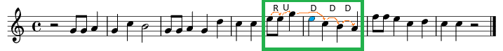
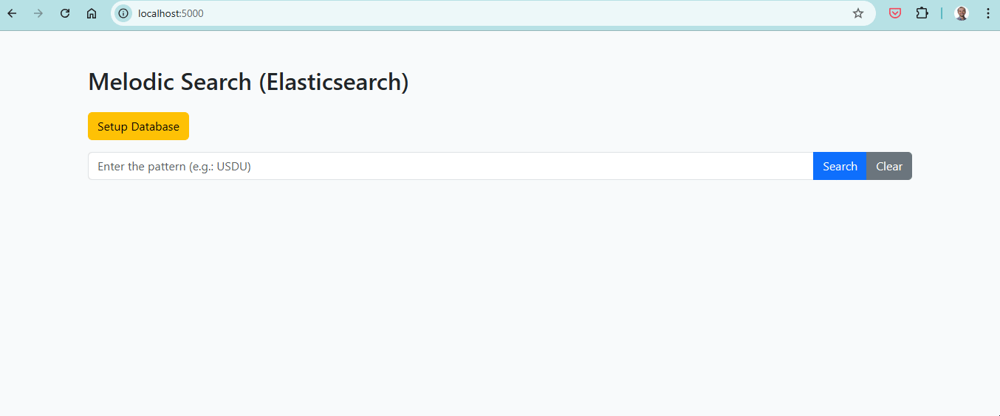

# Melodic Search with Elasticsearch

🎶 **Busca fuzzy de padrões melódicos usando contornos e n-gramas em Elasticsearch**

Este projeto demonstra como adaptar mecanismos de busca textual para encontrar **padrões melódicos semelhantes**, mesmo com transposições ou pequenas variações. A abordagem combina abstração musical, NLP simbólico e o poder do Elasticsearch.

---

## 🔍 Visão geral

A ideia nasceu da seguinte pergunta:

> E se fosse possível buscar por melodias da mesma forma que buscamos por frases com erros de digitação?

Neste repositório, você encontrará:
- Transformação de melodias em contornos simbólicos (`U-Up`, `D-Down`, `R-Repeat`)
- Geração de n-gramas a partir desses contornos
- Mapeamento e análise no Elasticsearch com suporte a `fuzziness`
- Exemplos de queries e visualizações dos resultados

---

## 🧠 Motivação

Esse trabalho foi inspirado e expandido a partir da minha dissertação de mestrado, onde exploro em mais profundidade a representação simbólica de melodias:

🔗 [Meu LinkedIn (dissertação anexada em Formação Acadêmica)](https://www.linkedin.com/in/alexcaranha/)

---

## 🚀 Como rodar

Você pode rodar o projeto facilmente utilizando Docker Compose:

```sh
docker-compose up
```

Isso irá iniciar tanto o Elasticsearch quanto o serviço de busca melódica.

📊 Demonstração

Utilizando o trecho da música "Parabéns a você" abaixo, sem a nota Mi (destacada em azul):


Informamos ao programa o padrão "RUDDD", destacado no quadro verde da imagem acima, para buscar as músicas no banco de dados (composto por 10 músicas).

O sistema busca corretamente a música "Parabéns a você".
